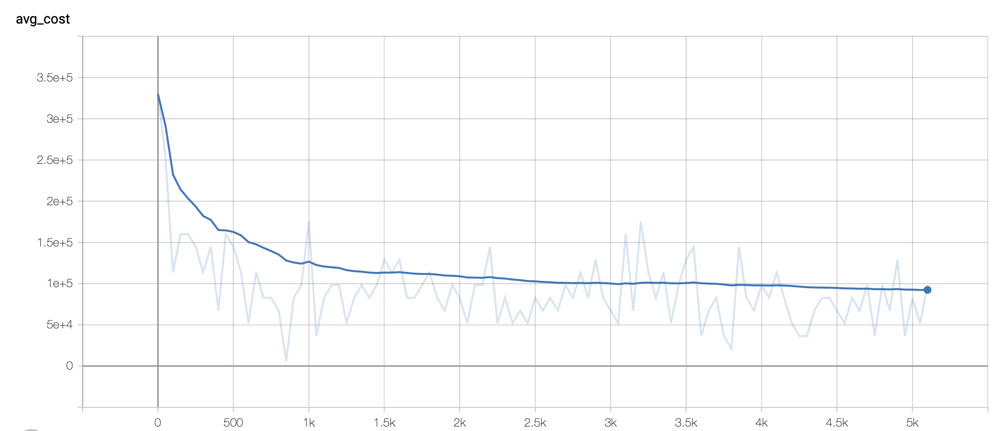

#### Current work
- Trying to apply Attention model by Wouter to this problem
- Have tried to solve this problem using penalizing as masking strategy
- 
- Is coding using backtracking

#### Questions
1. What are the differences between our problem and TSP?

   Differences here refer to the details of the algorithm we need to modify to apply Wouter Kool's model to our problem.

   - can not use masking to represent all the constraints in our pcb-routing problem. (Theoretically we can, but with a extremely high cost)
     + penalize the routes which break the rules
     + use backtracking, as suggested by Wouter
     + The decoder 

2. Why do I get this message printed while using copt.getProblem()?

   - Failed to generate clean data
   
     far apart
   
3. What decoding strategy are you using to get your current result? (85% success rate, measuring 1.03 times bigger the optimal one)

	- Greedy*, sampling, Beam searching

#### Future plan

modify network, sampling, Kool's next paper

produce training data before training and validating

1. Finish coding backtracking masking strategy

2. Apply basic imitation learning method to this problem

3. Do experiments on different graph sizes and use SuccessiveHalving to do hyperparameter tuning